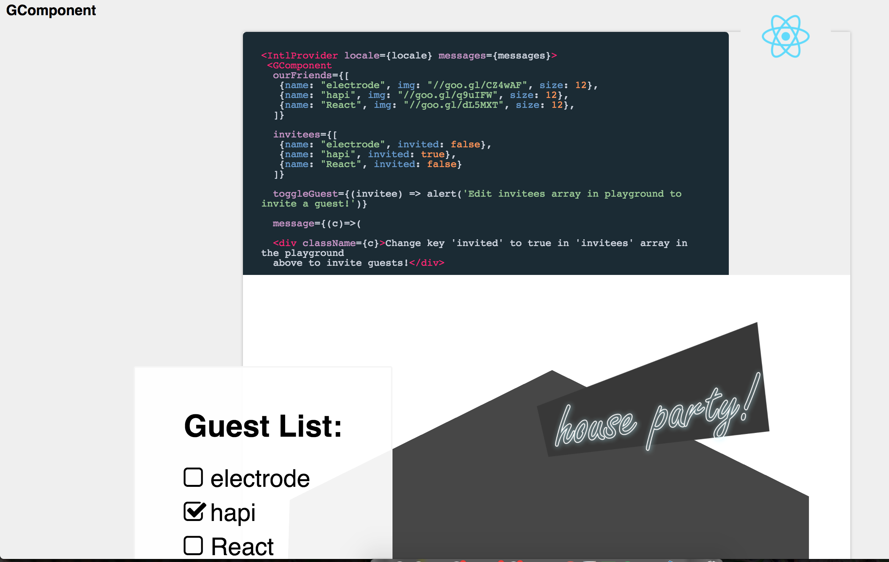
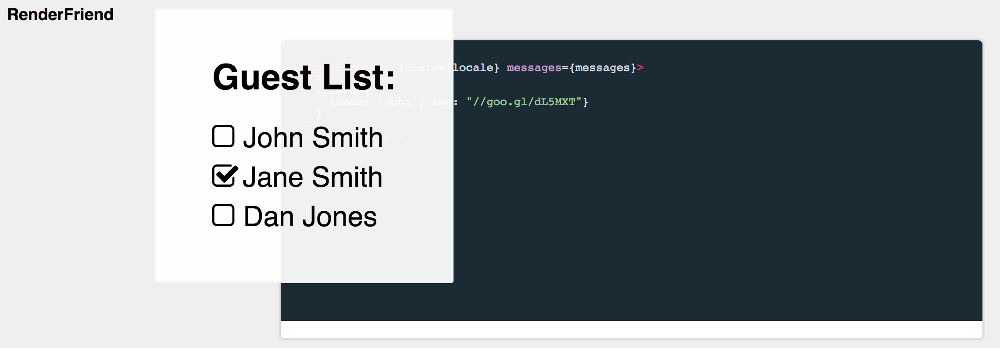

# g-component

Demo component from the Electrode tutorial at http://www.electrode.io/docs/create_reusable_component.html

## Demo & Examples

To build the examples locally, run:

```
yarn install --ignore-engines
gulp open-dev
```

Then open [`localhost:4000`](http://localhost:4000) in a browser.

## Screenshots





## Installation

The easiest way to use g-component is to install it from NPM and include it in your own React build process (using [Browserify](http://browserify.org), [Webpack](http://webpack.github.io/), etc).

You can also use the standalone build by including `dist/g-component.js` in your page. If you use this, make sure you have already included React, and it is available as a global variable.

```
npm install g-component --save
```


## Usage

__EXPLAIN USAGE HERE__

```
var GComponent = require('g-component');

<GComponent>Example</GComponent>
```

### Properties

* __DOCUMENT PROPERTIES HERE__

### Notes

__ADDITIONAL USAGE NOTES__


## Development (`src`, `lib` and the build process)

**NOTE:** The source code for the component is in `src`. A transpiled CommonJS version (generated with Babel) is available in `lib` for use with node.js, browserify and webpack. A UMD bundle is also built to `dist`, which can be included without the need for any build system.

To build, watch and serve the examples (which will also watch the component source), run `npm start`. If you just want to watch changes to `src` and rebuild `lib`, run `npm run watch` (this is useful if you are working with `npm link`).

## License

__PUT LICENSE HERE__

Copyright (c) 2017 .
